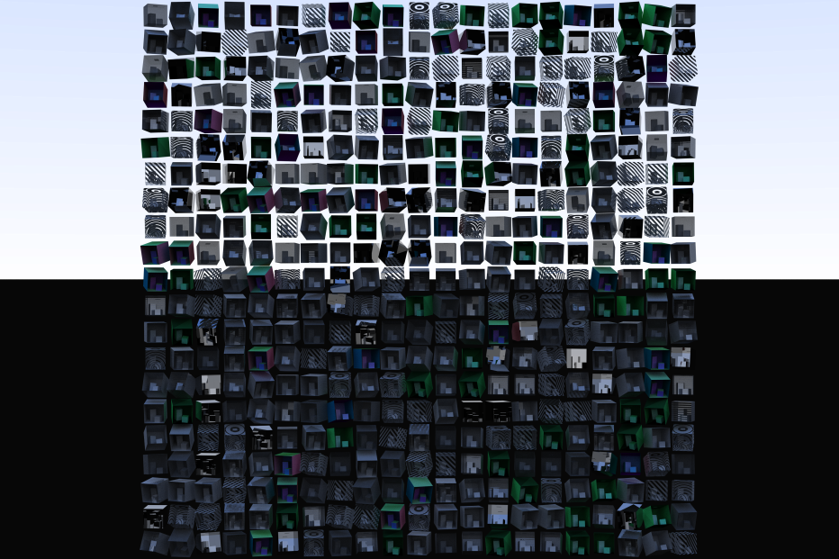

[](fullsize.png)

# vk_mini_path_tracer

This branch is the [Circle C++ shaders](https://github.com/seanbaxter/shaders/blob/master/README.md) port of [Neil Bickford](https://twitter.com/neilbickford)'s **[Vulkan mini path tracer tutorial](https://nvpro-samples.github.io/vk_mini_path_tracer/index.html)**.

Compile with [Circle build 110](https://www.circle-lang.org).

You'll need the dependencies listed [here](https://nvpro-samples.github.io/vk_mini_path_tracer/index.html#hello,vulkan!/settingupyourdevelopmentenvironment/installdependencies).

To build, try this:

```
# Download the nvpro framework.
$ mkdir path-tracing
$ cd path-tracing
path-tracing$ git clone git@github.com:nvpro-samples/shared_sources
path-tracing$ git clone git@github.com:nvpro-samples/shared_external

# Download the circle branch of the tutorial samples.
path-tracing$ git clone git@github.com:seanbaxter/vk_mini_path_tracer -b circle
path-tracing$ cd vk_mini_path_tracer

# Point cmake to circle. If it's in the path, it's real easy.
path-tracing/vk_mini_path_tracer$ cmake -DCMAKE_CXX_COMPILER=circle .

# Compile with some number of cores.
path-tracing/vk_mini_path_tracer$ make -j4

# The binaries were put in the bin_x64 folder. Go there.
path-tracing/vk_mini_path_tracer$ cd ../bin_x64

# Run some of the samples.
path-tracing/bin_x64$ ./vk_mini_path_tracer_e11_rt_pipeline_3.exe

# All samples write a new image to out.hdr in this folder.
# Use an image editor to view. HDR is an uncommon format, so most 
# viewes don't support it. I use GIMP.
path-tracing/bin_x64$ gimp out.hdr

# Ooh. Aah.
```

## Vulkan validator

Debug builds will bring the Vulkan validator into play. I suggest leaving this off right now. These samples use the bleeding-edge [VK_KHR_ray_query] extension, and support is very spotty in tools. On my system, the validator breaks when running some samples because it's not new enough to understand the SPIR-V capabilities.

## Circle changes

I ported most of the samples by copying code from Neil's GLSL, pasting it into main.cpp, and fixing some minor syntax issues. This serves as a useful test for the ray tracing and ray query support in Circle.

Once the tutorial incorporates materials, some of the C++ mechanism kicks in and we see real improvement over what shader languages offer.

### Object-oriented programming

As with the [SDF shadertoy sample](https://github.com/seanbaxter/shaders/blob/master/README.md#configuring-a-shader-from-json), I factor the materials into self-contained classes. 

[main.cpp](checkpoints/e10_materials/main.cpp)
```cpp
// A material where 50% of incoming rays pass through the surface (treating it
// as transparent), and the other 50% bounce off using diffuse reflection.
struct material4_t {
  ReturnedInfo sample(HitInfo hit, uint& rngState) const noexcept {
    ReturnedInfo result;
    result.color = color;
    if(stepAndOutputRNGFloat(rngState) < transparency) {
      result.rayOrigin    = offsetPositionAlongNormal(hit.worldPosition, hit.worldNormal);
      result.rayDirection = diffuseReflection(hit.worldNormal, rngState);

    } else {
      result.rayOrigin    = offsetPositionAlongNormal(hit.worldPosition, -hit.worldNormal);
      result.rayDirection = hit.rayDirection;
    }
    return result;
  }

  vec3 color = vec3(0.7);
  float transparency = .5;
};
```

Each material is expressed as a class with a standard interface: it takes a `HitInfo` struct, which has information about the ray that struck the primitive, and a reference to `uint`, which helps generate new random numbers. Effort has been taken to factor magic numbers out into data members. The color and transparency values are now data members rather than immediates, allowing the `material4_t` class to be bound to a uniform buffer object and controlled interactively. A user interface can even be generated automatically using reflection, as demonstrated in the [shadertoy samples](https://github.com/seanbaxter/shaders/blob/master/README.md#user-attributes-and-dear-imgui). Additionally, the design insulates the logic of the material from the idiosyncracies of the underlying API (in this case, Vulkan and SPIR-V). This allows the same code to be deployed on other parallel architectures (like CUDA and SYCL compilers) as well as the CPU. It's very easy to write path tracers for CPU, and being able to call your Vulkan/RTX materials allows you to potentially debug your path tracer with tools loggers and gdb.

### Using reflection 

```cpp
struct my_materials_t {
  material0_t mat0;
  material1_t mat1;
  material2_t mat2;
  material3_t mat3;
  material4_t mat4;
  material5_t mat5;
  material6_t mat6;
  material7_t mat7;
  material8_t mat8;
};
```

My port aggregates materials into new types. This type is a single point of definition for the path tracer instance. You can add and remove data members, and the shader and host code stay in sync, because they reflect off this definition.

```cpp
        switch(sbtOffset) {
          @meta for(int i = 0; i < @member_count(materials_t); ++i) {
            case i:
              returnedInfo = mat.@member_value(i).sample(hitInfo, rngState);
              break;
          }
        }
```

For example, the compute shader in [e10-materials](checkpoints/e10_materials/main.cpp) gets the SBT offset with the GLSL API, and uses that to switch into the right material. Reflection is used to generate that switch. See the [Circle reflection and typed enums](https://github.com/seanbaxter/circle/blob/master/reflection/README.md) document for more info on reflection.

### Using templates

The [e11/3 example](checkpoints/e11_rt_pipeline3/main.cpp) uses a separate closest-hit shader for each material. This is implemented with an rchit function template:

```cpp
template<typename material_t>
[[spirv::rchit]]
void rchit_shader() {
  HitInfo hitInfo = getObjectHitInfo();
  
  material_t mat;
  ReturnedInfo returned = mat.sample(hitInfo, shader_pld_in.rngState);
  
  shader_pld_in.color        = returned.color;
  shader_pld_in.rayOrigin    = returned.rayOrigin;
  shader_pld_in.rayDirection = returned.rayDirection;
  shader_pld_in.rayHitSky    = false;
}
```

The shader interrogates the ray tracing context to get intersection info. It invokes the material sampler function, passes this intersection info, and gets the color and out-going ray information.

```cpp
// Define the materials we want to support in a type list.
enum typename my_materials_t {
  material0_t,
  material1_t,
  material2_t,
  material3_t,
  material4_t,
  material5_t,
  material6_t,
  material7_t,
  material8_t,
};
```

The compute shader example aggregated all its materials into a struct. The ray tracing pipeline examples uses a type list to collect them. This type list is the single point of definition for the path tracer materials. The host code that names the rchit shaders loops over the types in this list and specializes the shader function template over each named material:

```cpp

    @meta for(int i = 0; i < NUM_C_HIT_SHADERS; ++i) {
      stages[2 + i] = stages[0];
      stages[2 + i].stage = VK_SHADER_STAGE_CLOSEST_HIT_BIT_KHR;
      stages[2 + i].pName = @spirv(rchit_shader<@enum_type(my_materials_t, i)>);
    }
```

The techniques of object-oriented programming and reflection help encourage a design that produces reusable code that compiles for multiple targets.
